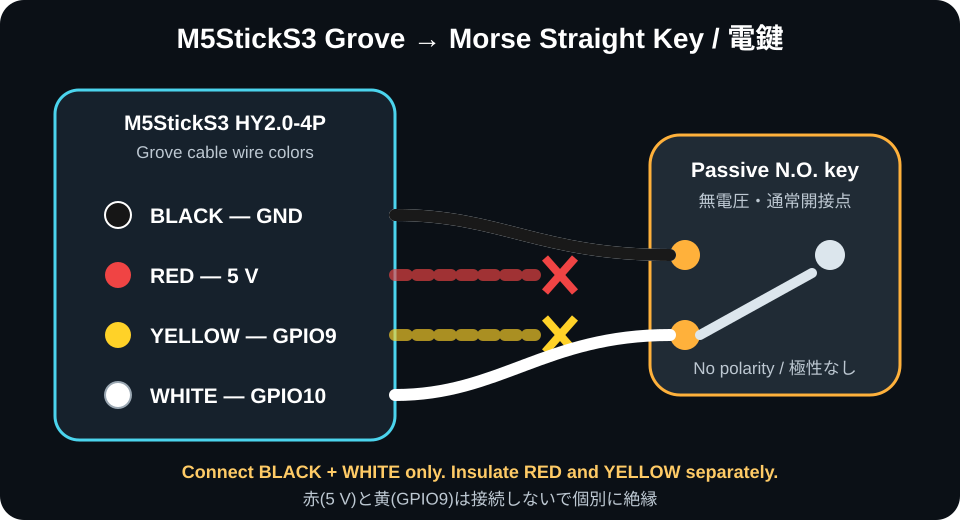
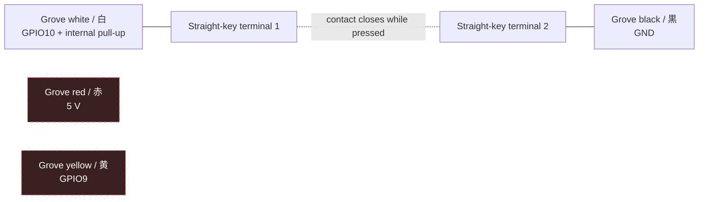

# Grove straight-key connection / Grove 電鍵接続

Use a passive, normally-open two-terminal Morse straight key and an
HY2.0-4P-to-bare-wire cable. The key requires no power and has no polarity.

無電圧・通常開の2端子ストレートキー（電鍵）と、HY2.0-4P Grove－バラ線ケーブルを
使用します。電鍵に極性はありません。

| Grove wire | StickS3 signal | Connect to the key? |
|---|---|---|
| Black / 黒 | GND | Yes—either key terminal / どちらか一方の端子 |
| Red / 赤 | 5 V | **No—insulate separately / 接続せず個別に絶縁** |
| Yellow / 黄 | GPIO9 | **No—insulate separately / 接続せず個別に絶縁** |
| White / 白 | GPIO10 | Yes—the other key terminal / もう一方の端子 |

If your key uses a 3.5 mm TS plug, the suggested convention is white to tip
and black to sleeve. Confirm the two contacts with a continuity tester because
key cables are not universally wired. For binding posts, connect one post to
white and the other to black.

3.5 mm TSプラグの場合は、白をTip、黒をSleeveにする構成を推奨します。ただし
市販ケーブルの結線は一定ではないため、導通テスターで「押した時だけ短絡」する
2接点を確認してください。端子台式の電鍵は、白と黒をそれぞれ片方ずつ接続します。

## Firmware behavior

- GPIO10 is `INPUT_PULLUP`; open is HIGH and a pressed key is LOW.
- The internal pull-up is approximately 45 kOhm per Espressif's Arduino GPIO
  documentation.
- An 8 ms software debounce rejects ordinary contact bounce.
- Button A and the Grove key are OR-combined. If both are pressed, the logical
  key stays down until both are released.
- The same crisp 880 Hz sidetone plays while the external key is down.
- The display reports `GROVE KEYING`, `BUTTON KEYING`, or `A+GROVE KEYING`.
- Grove 5 V output remains disabled by this firmware.
- The Grove key is used only in KEY mode. MIC mode continues to use the built-in
  microphone.

## Safety and scope

Connect only a **dry contact**. Do not connect an electronic keyer's voltage,
an open-collector output of unknown polarity, audio, or another powered circuit
directly to GPIO10. The direct cable is a short, indoor prototype connection;
long or exposed cables need a 3.3 V input-conditioning/ESD adapter and bench
verification.

乾接点以外をGPIO10へ直結しないでください。電圧を出力する電子キーヤー、極性不明の
オープンコレクタ、音声信号、他の電源回路は対象外です。長いケーブルや屋外配線には、
3.3 V入力保護・ESD対策を備えたアダプターと実測確認が必要です。

Sources: [M5Stack StickS3 pin map](https://docs.m5stack.com/en/core/StickS3),
[M5Stack Grove convention](https://docs.m5stack.com/en/learn/interface/grove), and
[Espressif Arduino GPIO pull-up documentation](https://docs.espressif.com/projects/arduino-esp32/en/latest/api/gpio.html).
